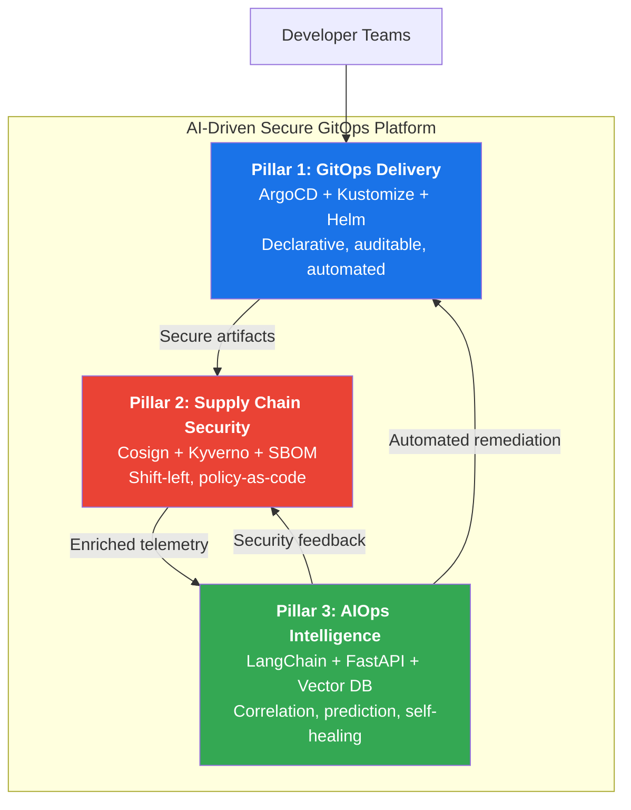

# Executive Overview: AI-Driven Secure GitOps Kubernetes Platform

## Document Control

| Attribute | Value |
|---|---|
| **Document ID** | ARC-EXEC-001 |
| **Version** | 1.0 |
| **Classification** | Internal — Leadership |
| **Author** | Platform Architecture Team |
| **Last Updated** | 2026-05-17 |

---

## 1. Executive Summary

Modern cloud-native organizations face a tripartite challenge: **delivering software at velocity**, **maintaining enterprise-grade security posture**, and **managing operational complexity at scale**. Traditional platform engineering approaches address these concerns in isolation, resulting in fragmented toolchains, manual security gates, and reactive incident response that cannot keep pace with deployment frequency.

The **AI-Driven Secure GitOps Kubernetes Platform** is a comprehensive internal developer platform (IDP) that unifies GitOps delivery, AI-powered observability, and automated supply-chain security into a single, cohesive control plane. Built on Amazon EKS and grounded in Kubernetes-native primitives, the platform enables development teams to deploy with **zero-touch security enforcement**, **AI-correlated incident response**, and **self-healing infrastructure**—all governed through declarative Git repositories as the single source of truth.

This document provides executive leadership with a strategic overview of the platform architecture, its design philosophy, expected business outcomes, and key performance indicators for measuring success.

---

## 2. Problem Statement

### 2.1 The Three Gaps

| Gap | Description | Business Impact |
|---|---|---|
| **Velocity vs. Security** | Security scanning and manual approval gates slow CI/CD pipelines | 40–60% longer lead times; developer friction |
| **Observability vs. Action** | Tools generate alerts but lack correlation and root-cause analysis | Mean Time to Resolution (MTTR) exceeds 4–8 hours |
| **Scale vs. Control** | Multi-cluster, multi-team environments lack unified policy enforcement | Configuration drift; audit gaps; shadow operations |

### 2.2 Industry Context

The 2025 State of Kubernetes Report indicates that 87% of organizations running Kubernetes in production have experienced a security incident, with **misconfigurations** and **supply-chain vulnerabilities** accounting for 62% of all breaches. Simultaneously, platform teams report that **45% of their time** is spent on manual remediation and operational firefighting rather than feature delivery.

---

## 3. Solution Overview

The platform addresses these challenges through three integrated pillars:

### 3.1 Pillar 1: GitOps Delivery

Every infrastructure and application change flows through Git repositories. ArgoCD reconciles desired state with live cluster state, ensuring drift is automatically detected and corrected. Helm and Kustomize provide layered configuration management for multi-environment, multi-tenant deployments.

### 3.2 Pillar 2: Supply Chain Security

All container images are signed with Cosign, attested with in-toto metadata, and scanned for vulnerabilities before admission. Kyverno policies enforce runtime constraints, image provenance, and cryptographic verification at the point of admission, creating an immutable audit trail from commit to deployment.

### 3.3 Pillar 3: AIOps Intelligence

The AI subsystem ingests metrics, logs, traces, and security events into a vector-embedded knowledge base. A LangChain-powered reasoning engine correlates signals across observability pillars, identifies root causes, and triggers automated remediation workflows. This transforms the platform from reactive alerting to predictive operations.

---

## 4. Key Design Principles

### 4.1 Declarative Over Imperative
Every resource, policy, and configuration is expressed declaratively in Git. There are no imperative shell commands, no click-ops, no drift-prone manual interventions. The cluster is a reflection of the repository.

### 4.2 Security Embedded, Not Bolted On
Security is not a gate at the end of the pipeline—it is encoded into every layer. Images are signed at build time, policies are enforced at admission time, and runtime anomalies are detected and correlated within seconds.

### 4.3 AI-Augmented, Not AI-Controlled
The AI subsystem recommends and, where risk-thresholds permit, executes remediations. All automated actions are logged, auditable, and configurable. Human operators retain final authority over any destructive operation.

### 4.4 Opinionated Minimalism
The platform selects a single, best-in-class tool for each concern (one GitOps operator, one admission controller, one AI framework) rather than offering choice. This reduces cognitive load, simplifies troubleshooting, and accelerates onboarding.

### 4.5 Cost-Aware by Default
Resource allocation, autoscaling, and cluster sizing are instrumented with cost metrics. Teams see the cost impact of their deployments in real time through the platform dashboard.

---

## 5. Technology Stack Summary

| Layer | Technology | Rationale |
|---|---|---|
| **Container Orchestration** | Amazon EKS (K8s 1.30+) | Managed control plane, IRSA, KMS integration |
| **GitOps Operator** | ArgoCD 2.12+ | Mature, multi-cluster, App-of-Apps pattern |
| **Config Management** | Helm + Kustomize | Composable, environment-aware overlays |
| **Container Registry** | Amazon ECR + Notary | Native KMS signing, immutable tags |
| **Image Signing** | Cosign + Sigstore | OIDC-based keyless signing; SBOM attachment |
| **Policy Engine** | Kyverno 1.13+ | Kubernetes-native, mutating/validating policies |
| **Secret Management** | External Secrets Operator + AWS Secrets Manager | No secrets in Git; IAM-backed retrieval |
| **Observability** | Prometheus + Grafana + OpenTelemetry | CNCF graduated; vendor-neutral |
| **AI/ML Inference** | FastAPI + LangChain + pgvector | Lightweight, Python-native, PostgreSQL-backed |
| **Ingress/Gateway** | Istio + Envoy + Gateway API | mTLS, fine-grained authz, telemetry |
| **Runtime Security** | Falco + Falco Talons | Kernel-level syscall monitoring |
| **CI/CD Orchestrator** | GitHub Actions / GitLab CI | Widely adopted; OIDC integration |

---

## 6. Business Value and Strategic KPIs

### 6.1 Anticipated Business Outcomes

| Metric | Baseline (Current) | Target (Platform) | Timeline |
|---|---|---|---|
| **Lead Time for Changes** | 2–5 days | < 2 hours | Q2 |
| **Deployment Frequency** | 1–2 / week | 50+ / day | Q2 |
| **Mean Time to Recovery (MTTR)** | 4–8 hours | < 15 minutes | Q3 |
| **Change Failure Rate** | 15–25% | < 5% | Q3 |
| **Security Incident Response Time** | 2–4 hours | < 60 seconds (automated) | Q3 |
| **Platform Engineering Toil** | 45% of team time | < 10% | Q4 |
| **Cost Per Deployment** | $12.50 | $0.42 | Q4 |

### 6.2 Strategic Value Drivers

- **Developer Velocity**: Self-service environments with no platform ticket required; push-to-deploy in under 2 hours.
- **Compliance Automation**: SOC 2, PCI-DSS, and NIST 800-53 controls enforced as code; audit evidence generated continuously.
- **Operational Resilience**: Self-healing infrastructure reduces on-call burden by an estimated 60%.
- **Vendor Independence**: CNCF-graduated open-source stack avoids lock-in; each component can be swapped independently.

---

## 7. Architecture Philosophy

The platform follows the **"Paved Road"** model: a well-lit, fully supported path that makes the right thing the easy thing. Teams may diverge from the paved road, but doing so requires explicit exemption and places them outside the platform SLA boundary.

The architecture is **API-first by default**. Every capability—deployment, policy change, secret rotation, AI query—is exposed via a consistent REST or gRPC API. The Git repository remains the source of truth, but APIs enable automation, chatbot integrations, and custom tooling.

Fifteen minutes is the maximum tolerated MTTR for any production incident. The AI subsystem is designed to achieve this through automated detection, correlation, and—where risk scores permit—fully automated remediation without human intervention.

---

## 8. Next Steps

The architecture detailed in subsequent documents operationalizes these principles through concrete component specifications, request flow diagrams, security boundaries, deployment topology, and engineering decision records. Readers should proceed through the document set sequentially:

1. **02-component-architecture.md** — Full component decomposition with C4 diagrams
2. **03-request-flows.md** — End-to-end sequence diagrams for all major workflows
3. **04-security-architecture.md** — Trust boundaries, threat model, compliance mapping
4. **05-deployment-architecture.md** — Multi-AZ HA topology, DR, networking, cost model
5. **06-engineering-decisions.md** — ADR-format rationale for every technology choice
