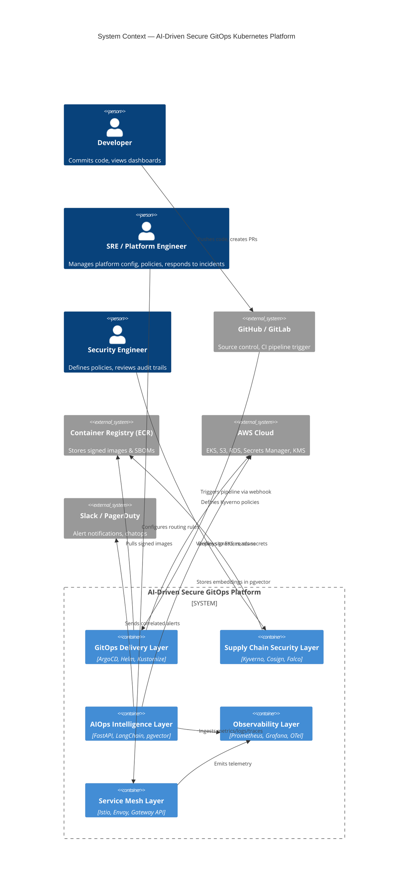
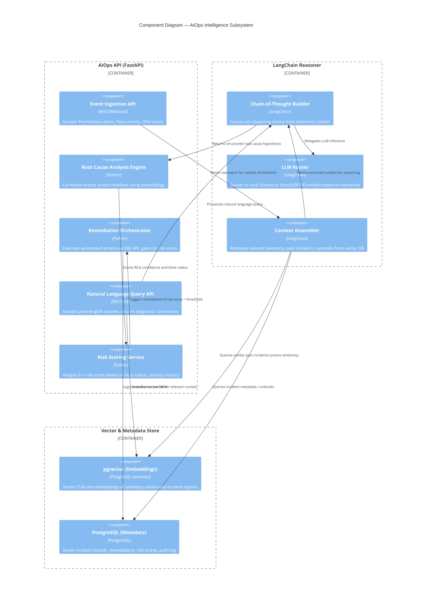
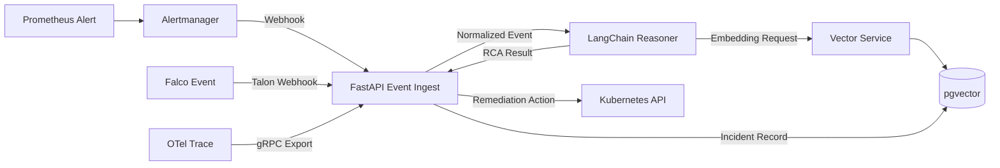
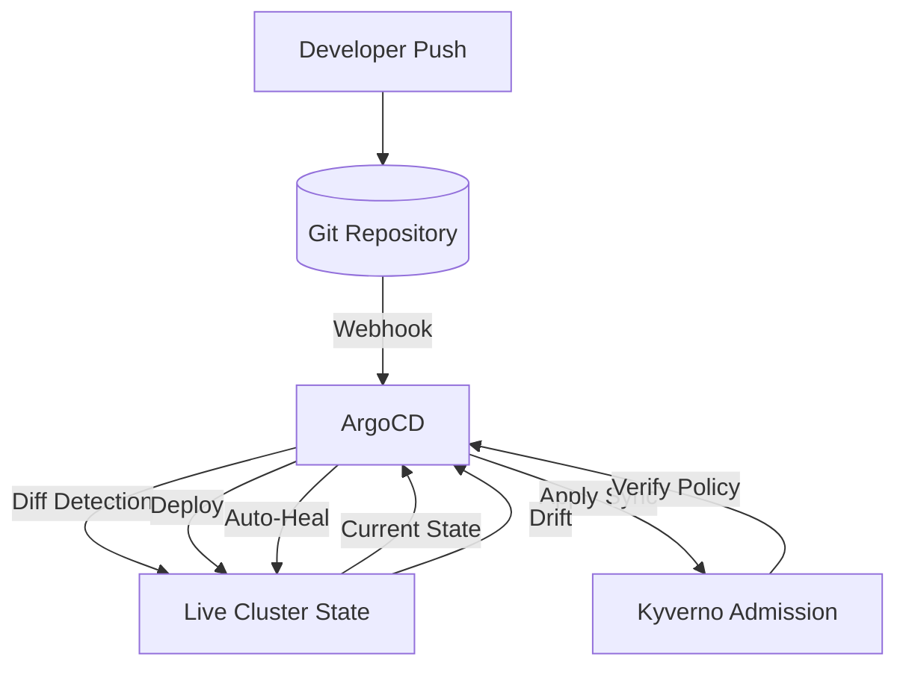
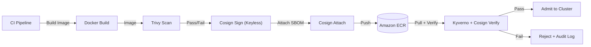

# Component Architecture: AI-Driven Secure GitOps Kubernetes Platform

## Document Control

| Attribute | Value |
|---|---|
| **Document ID** | ARC-COMP-002 |
| **Version** | 1.0 |
| **Classification** | Internal — Engineering |
| **Author** | Platform Architecture Team |
| **Last Updated** | 2026-05-17 |

---

## 1. System Context Diagram (C4 Level 1)

The following diagram shows the platform as a black-box system interacting with external actors.



---

## 2. Container Diagram (C4 Level 2)

The container diagram decomposes the platform into its major runtime containers and their interactions.

```mermaid
C4Container
    title Container Diagram — Platform Decomposition

    Person(dev, "Developer", "Deploys applications")

    System_Boundary(platform, "AI-Driven Secure GitOps Platform") {

        System_Boundary(gitops_layer, "GitOps Delivery Layer") {
            Container(argocd, "ArgoCD", "Go/GRPC", "Git-to-cluster reconciliation, App-of-Apps sync")
            Container(helm, "Helm + Kustomize", "YAML/Go", "Chart templating, environment overlays, variable substitution")
            Container(webhook, "Git Webhook Receiver", "Go", "Validates commit signatures, triggers CI pipelines")
        }

        System_Boundary(security_layer, "Supply Chain Security Layer") {
            Container(kyverno, "Kyverno", "Go/Webhook", "Admission policies, image verification, mutation")
            Container(cosign, "Cosign Verifier", "Go", "Signature verification, attestation validation")
            Container(falco, "Falco + Talons", "C/eBPF", "Kernel-level runtime syscall monitoring, rule engine")
            Container(sbom, "SBOM Generator (Syft)", "Go", "SPDX-2.3 SBOM generation, vulnerability enrichment")
            Container(signer, "Cosign Signer", "Go", "Keyless signing via Sigstore OIDC, in-toto attestations")
        }

        System_Boundary(aio_layer, "AIOps Intelligence Layer") {
            Container(fastapi, "AIOps API (FastAPI)", "Python", "REST API for AI queries, alert ingestion, remediation triggers")
            Container(langchain, "LangChain Reasoner", "Python", "LLM orchestration, chain-of-thought RCA, context assembly")
            Container(vector, "Vector Embedding Service", "Python", "Converts telemetry to embeddings, stores in pgvector")
            Container(pgvector, "pgvector Database", "PostgreSQL", "Vector DB for similarity search, telemetry metadata store")
            Container(cluster, "Anomaly Clustering Engine", "Python/NumPy", "DBSCAN/k-means clustering of incidents by embedding distance")
        }

        System_Boundary(obs_layer, "Observability Layer") {
            Container(prom, "Prometheus", "Go/TSDB", "Time-series metrics collection, alerting rules, recording rules")
            Container(grafana, "Grafana", "Go/React", "Dashboards, alert management, AI-driven dashboard suggestions")
            Container(otel, "OpenTelemetry Collector", "Go", "Trace/metric/log collection, batching, sampling, export")
            Container(alert, "Alertmanager", "Go", "Deduplication, grouping, routing, silencing, inhibition")
        }

        System_Boundary(mesh_layer, "Service Mesh & Networking") {
            Container(istiod, "Istiod (Control Plane)", "Go", "Pilot, Citadel, Galley — service discovery, mTLS, config distribution")
            Container(envoy, "Envoy Proxy (Sidecar)", "C++", "L7 traffic management, mTLS termination, telemetry generation")
            Container(gateway, "Istio Gateway", "C++/Envoy", "Ingress traffic, TLS termination, route splitting, authz")
        }
    }

    Rel(dev, helm, "Configures Helm values & Kustomize overlays")
    Rel(helm, argocd, "Generates manifests for sync")
    Rel(argocd, kyverno, "Submits resources for admission (pre-sync)")
    Rel(kyverno, cosign, "Delegates image signature verification")
    Rel(cosign, sbom, "Retrieves and verifies SBOM attestations")

    Rel(falco, fastapi, "Streams events via Falco Talon webhook")
    Rel(fastapi, langchain, "Delegates complex reasoning chains")
    Rel(langchain, vector, "Generates embeddings for context")
    Rel(vector, pgvector, "Stores & queries vector embeddings")
    Rel(fastapi, cluster, "Runs clustering algorithms on incidents")
    Rel(cluster, pgvector, "Reads embeddings for similarity grouping")

    Rel(otel, prom, "Forwards metrics")
    Rel(prom, alert, "Sends alert events based on rules")
    Rel(alert, fastapi, "Webhooks enriched alert payloads")
    Rel(otel, fastapi, "Forwards trace data for anomaly detection")
    Rel(envoy, otel, "Emits telemetry via Envoy's OTel access log")

    Rel(fastapi, grafana, "Creates annotated dashboard panels")
    Rel(fastapi, slack, "Sends enriched, correlated incident summaries")

    Rel(gateway, envoy, "Routes traffic to mesh workloads")
    Rel(istiod, envoy, "Distributes mTLS certs & routing config")
```

---

## 3. Component Diagram — AIOps Intelligence Layer (C4 Level 3)

This depth-level diagram shows the internal structure of the AIOps subsystem, the most architecturally novel component.



---

## 4. Platform Services and Responsibilities

### 4.1 GitOps Delivery Layer

| Service | Responsibility | Key Metrics |
|---|---|---|
| **ArgoCD Server** | Git repository reconciliation, sync operations, drift detection, webhook handling | Sync time < 30s; drift detection latency < 60s |
| **ArgoCD Application Controller** | Manages Application CR lifecycles, health assessment, pruning | Application count per cluster: 500+ |
| **Helm Controller** | Renders Helm charts, manages releases, rollback support | Chart release time < 15s |
| **Kustomize Controller** | Applies Kustomize overlays, secret generation, configMap generation | Overlay apply time < 5s |

### 4.2 Supply Chain Security Layer

| Service | Responsibility | Key Metrics |
|---|---|---|
| **Kyverno Admission Controller** | Validating and mutating webhooks; enforces 30+ policy rules at pod admission | Admission latency < 50ms; 100% enforcement |
| **Cosign Verifier** | Verifies container image signatures and attestations at deploy time | Verification time < 2s per image |
| **Falco** | Kernel-level syscall monitoring; 100+ default Falco rules; real-time alert stream | Event throughput 10K/sec per node |
| **SBOM Service** | Generates SPDX-2.3 SBOMs for every build; uploads to OCI registry as attestation | Generation time < 60s per image |
| **Trivy Operator** | Continuous vulnerability scanning of running pods; updates vulnerability reports | Scan cycle < 5 minutes per node |

### 4.3 AIOps Intelligence Layer

| Service | Responsibility | Key Metrics |
|---|---|---|
| **Event Ingestion API** | Receives and normalizes alerts from Prometheus, Falco, and OTel; 5 event types unified | Throughput 5K events/sec; P99 < 100ms |
| **LangChain Reasoner** | Constructs multi-step reasoning chains; routes to appropriate LLM (local or cloud) | Reasoning time < 10s per incident |
| **Embedding Service** | Converts telemetry events to 1536-dim vector embeddings via sentence-transformers | Embedding latency < 200ms per event |
| **Anomaly Clustering** | Groups related incidents by embedding cosine distance; DBSCAN clustering | Cluster formation < 30s per 1K events |
| **Remediation Orchestrator** | Executes automated K8s operations (scale, restart, network policy change); gates on risk score | Action execution < 5s; risk score computation < 500ms |

### 4.4 Observability and Mesh Layers

| Service | Responsibility | Key Metrics |
|---|---|---|
| **Prometheus** | 10M+ active time series; 30-day retention; recording rules for SLO burn rate | Query latency P99 < 1s |
| **Grafana** | 200+ dashboards; unified view of metrics, logs, traces, AI insights | Dashboard load < 3s |
| **OpenTelemetry Collector** | 50K spans/sec; tail-based sampling; metrics correlation | Export latency P99 < 500ms |
| **Istio Control Plane** | mTLS cert rotation every 24h; service discovery for 200+ services | Config propagation < 10s |
| **Envoy Sidecar** | L7 traffic management; HTTP/gRPC; telemetry generation | P99 latency overhead < 2ms |

---

## 5. Integration Patterns

### 5.1 Event-Driven Integration (AIOps)



### 5.2 GitOps Reconciliation Loop



### 5.3 Secure Supply Chain Build



### 5.4 Multi-Cluster Federation

ArgoCD operates in an App-of-Apps pattern: a single management cluster hosts ArgoCD, which reconciles Applications across 10+ workload clusters (dev, staging, prod in multiple regions). Cluster registration secrets are stored in AWS Secrets Manager and synced via External Secrets Operator.
