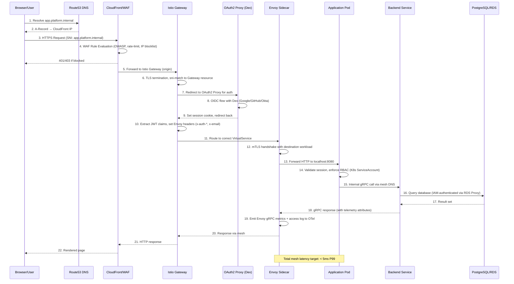
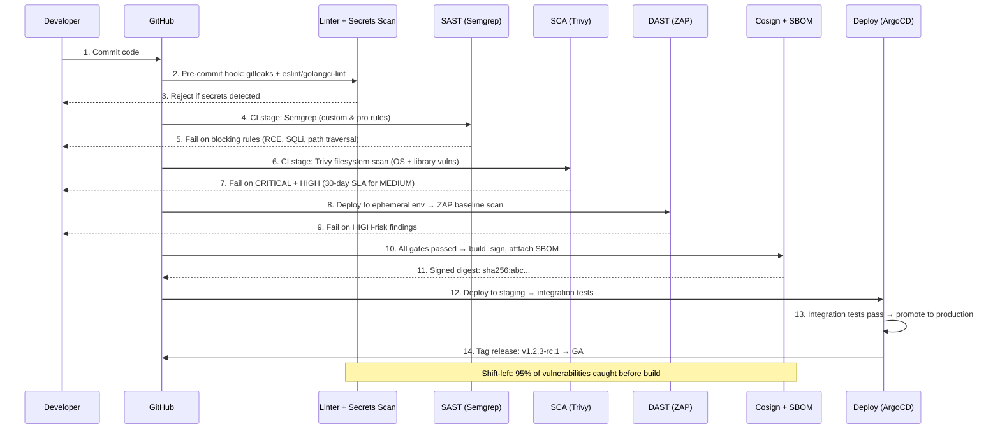
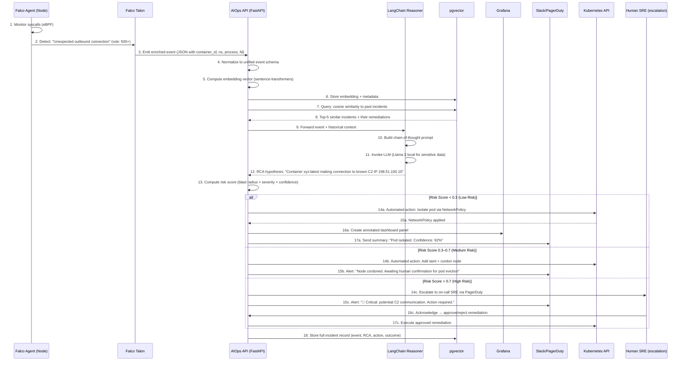
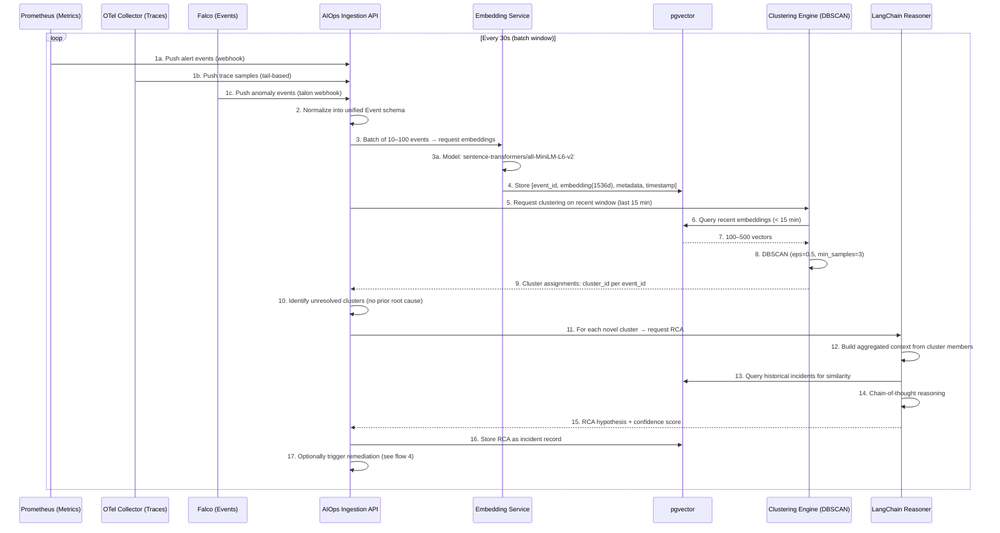

# Request Flows: AI-Driven Secure GitOps Kubernetes Platform

## Document Control

| Attribute | Value |
|---|---|
| **Document ID** | ARC-FLOW-003 |
| **Version** | 1.0 |
| **Classification** | Internal — Engineering |
| **Author** | Platform Architecture Team |
| **Last Updated** | 2026-05-17 |

---

## 1. User Request Flow

A developer accesses a platform-deployed application through their browser. This flow traces the request from DNS resolution through the service mesh to the backend application pod.



### Flow Characteristics

| Step | Component | Latency Budget | Security Control |
|---|---|---|---|
| TLS Termination | Gateway | < 2ms | TLS 1.3, HSTS, mTLS between services |
| AuthN/AuthZ | OAuth2 Proxy | < 100ms | OIDC + Dex + RBAC mapping |
| WAF Inspection | CloudFront | < 50ms | OWASP CRS 3.3, rate limiting |
| Mesh Routing | Envoy | < 2ms | mTLS, AuthorizationPolicy, PeerAuthentication |
| App Processing | Application | < 500ms | Pod Security Policy, seccomp, readOnlyRootFilesystem |

---

## 2. GitOps Delivery Lifecycle

The complete path from a developer's commit to a running application pod in production, driven entirely through Git.

```mermaid
sequenceDiagram
    participant DEV as Developer
    participant GIT as GitHub Repository
    participant CI as GitHub Actions CI
    participant REG as Amazon ECR
    participant SBOM as SBOM Service (Syft)
    participant SIGN as Cosign Signer
    participant ARGO as ArgoCD
    participant K8S as Kubernetes Cluster
    participant KYV as Kyverno

    DEV->>GIT: 1. git push (feature branch)
    GIT->>CI: 2. Webhook trigger: push event
    CI->>CI: 3. Checkout, lint, unit tests
    CI->>CI: 4. Build container image
    CI->>CI: 5. Run Trivy vulnerability scan
    alt Scan fails (CRITICAL/HIGH)
        CI-->>DEV: 6. Fail pipeline; notify developer
    else Scan passes
        CI->>SBOM: 7. Generate SPDX-2.3 SBOM
        SBOM->>SIGN: 8. Sign image & SBOM (keyless Sigstore)
        SIGN->>REG: 9. Push signed image:tag
        SIGN->>REG: 10. Attach SBOM as OCI artifact
        CI->>GIT: 11. Update k8s manifest with new image digest
        DEV->>GIT: 12. Open PR to main branch
        GIT->>GIT: 13. PR checks: policy-bot, DCO, required reviews
        GIT->>CI: 14. Merge to main → trigger deploy pipeline
        CI->>GIT: 15. Update ArgoCD app-of-apps manifest
        GIT-->>ARGO: 16. Commit change to config repo
        ARGO->>ARGO: 17. Detect drift (desired vs. live state)
        ARGO->>KYV: 18. Submit resource for admission
        KYV->>KYV: 19. Evaluate 30+ policy rules
        KYV->>KYV: 20. Verify Cosign signature on image
        KYV->>KYV: 21. Verify SBOM attestation
        alt Policy violation
            KYV-->>ARGO: 22. Admission denied (ValidatingWebhook)
            ARGO-->>DEV: 23. Sync failure notification
        else All policies pass
            KYV-->>ARGO: 24. Admission allowed
            ARGO->>K8S: 25. Apply manifest (rolling update)
            K8S->>K8S: 26. Pod readiness probe, liveness probe
            K8S-->>ARGO: 27. Health check PASS
            ARGO-->>DEV: 28. Sync complete; application healthy
        end
    end
```

### Delivery Cadence Specifications

| Stage | Duration (Target) | Automation Level |
|---|---|---|
| Code push to CI trigger | < 5s | Fully automated |
| CI build + scan | < 3 minutes | Fully automated |
| SBOM generation + sign | < 30s | Fully automated |
| PR review cycle | < 4 hours | Human-in-loop (policy-bot auto-approve for low-risk) |
| ArgoCD sync + admission | < 60s | Fully automated |
| Pod readiness | < 30s | Health checks |
| **Total (commit to pod)** | **< 2 hours** (target: < 15 min for critical patches) | |

---

## 3. Secure SDLC Flow

Every commit passes through a gauntlet of automated security checks before reaching production.



### Security Gate Configuration

| Gate | Tool | Blocking Threshold | Exceptions |
|---|---|---|---|
| Secret Leakage | Gitleaks | Any secret-like pattern | False-positive review within 24h |
| SAST | Semgrep | RCE, SQLi, OS Command, Path Traversal | None; must fix before merge |
| SCA | Trivy | CRITICAL or HIGH with fix available | 7-day SLA with approved exception |
| Image Signing | Cosign | Unsigned image → reject at admission | None in production namespaces |
| SBOM Attestation | Syft + Cosign | Missing or malformed SBOM | None; must regenerate |

---

## 4. Incident Response Flow

When Falco detects a runtime anomaly, the platform's AI-driven incident response pipeline activates.



### Incident Response SLA

| Severity | Detection | AI Correlation | Automated Response | Human Escalation |
|---|---|---|---|---|
| **Critical** (C2, privilege esc) | < 5s | < 15s | < 30s | Immediate |
| **High** (crypto miner, data exfil) | < 10s | < 30s | < 60s | < 2 min |
| **Medium** (policy violation, unusual traffic) | < 30s | < 2 min | < 5 min | < 10 min |
| **Low** (info, best practice) | < 60s | N/A | Logged | Batched daily |

---

## 5. AI Correlation Workflow

The system ingests multi-modal telemetry and performs unsupervised learning to identify incident patterns.



### Embedding Strategy

| Telemetry Type | Input Features | Embedding Model | Dimensionality |
|---|---|---|---|
| Prometheus Alert | rule_name, labels, annotations, severity, timestamp | MiniLM-L6-v2 | 1536 |
| Falco Event | rule, priority, container_id, process, fd, syscall | MiniLM-L6-v2 | 1536 |
| OTel Trace | service_name, operation, error_type, duration_ms, status_code | MiniLM-L6-v2 | 1536 |
| Incident Record | RCA summary, remediation, affected_services, resolved_by | BAAI/bge-small-en-v1.5 | 384 |

---

## 6. Self-Healing Workflow

Automated remediation workflow triggered when an anomaly is detected and the risk score is below the automated-action threshold.

```mermaid
sequenceDiagram
    participant M as Monitoring (Prom/Grafana)
    participant AI as AIOps API
    participant LC as LangChain Reasoner
    participant K as Kubernetes API
    participant A as ArgoCD
    participant L as Logging Stack

    M-->>AI: 1. Alert: "High error rate (5.5% > SLO 1%) on svc:checkout"
    AI->>LC: 2. Enriched alert → request RCA + remediation plan
    LC->>LC: 3. Analyze: error_rate > threshold, p95_latency > 2000ms, pod OOMKill events
    LC-->>AI: 4. Hypothesis: "Pod memory leak in checkout:v2.1.0"
    LC-->>AI: 5. Recommendation: "Increase memory limit from 256Mi to 512Mi and rollout restart"
    AI->>AI: 6. Validate: risk score < 0.3 (config change, reversible)
    AI->>K: 7. Execute: Patch Deployment checkout memory limit
    K-->>AI: 8. Deployment patched
    AI->>A: 9. Trigger: Force ArgoCD sync (bypass reconciliation delay)
    A->>A: 10. Rolling restart of checkout pods
    A-->>AI: 11. Sync complete; 3/3 pods healthy
    AI->>M: 12. Monitoring: error rate trending down (3.2% → 1.8% → 0.9%)
    M-->>AI: 13. Confirm: error rate within SLO after 5 min
    AI->>L: 14. Log: Full incident report, action taken, outcome, duration
    AI->>AI: 15. Update risk model: similar patterns → lower threshold for auto-remediation

    Note over AI,LC: Healing cycle target: < 5 minutes from alert to resolution
```

### Self-Healing Action Catalog

| Action | Risk Score Threshold | Reversible | Approval Required |
|---|---|---|---|
| Increase resource limits | < 0.3 | Yes | No (auto) |
| Restart Deployment (rollout) | < 0.5 | Yes | No (auto) |
| Scale replicas (HPA override) | < 0.4 | Yes | No (auto) |
| NetworkPolicy isolation | < 0.3 | Yes | No (auto) |
| Rollback to previous revision | < 0.4 | Yes | No (auto) |
| Cordon/Drain node | < 0.6 | Yes | Human approval |
| Patch Ingress/WAF rule | < 0.5 | Yes | Human approval |
| Delete malicious pod | < 0.2 | No | Human approval |
| Scale down entire service | < 0.2 | Yes | Human approval |
| Modify RBAC/ClusterRole | N/A | Yes | Mandatory human approval |
