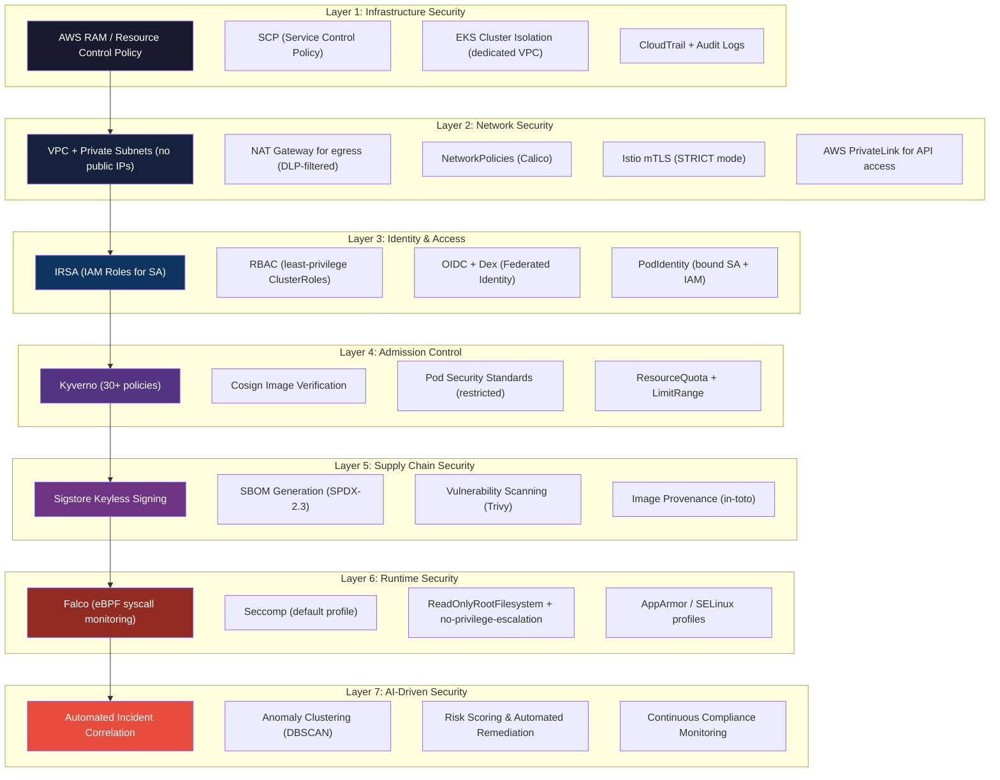

# Security Architecture: AI-Driven Secure GitOps Kubernetes Platform

## Document Control

| Attribute | Value |
|---|---|
| **Document ID** | ARC-SEC-004 |
| **Version** | 1.0 |
| **Classification** | Confidential — Security |
| **Author** | Platform Architecture Team |
| **Last Updated** | 2026-05-17 |

---

## 1. Trust Boundaries

The following diagram identifies all trust boundaries within the platform. Each boundary represents a transition where security controls must be enforced.

```mermaid
graph TB
    subgraph "Internet / Untrusted"
        USER["End User / Browser"]
        ATTACK["External Attacker"]
    end

    subgraph "Edge / Perimeter (Trust Level 1)"
        CF["CloudFront + WAF"]
        GW["Istio Gateway"]
    end

    subgraph "Platform DMZ (Trust Level 2)"
        OIDC["OAuth2 Proxy / Dex"]
        AUTH["Auth Service"]
        APP["Application Pods (dmz-ns)"]
    end

    subgraph "Platform Internal (Trust Level 3)"
        ARGO["ArgoCD"]
        KYV["Kyverno"]
        FALCO["Falco Agent"]
        PROM["Prometheus"]
        GRAF["Grafana"]
    end

    subgraph "AIOps (Trust Level 3 - Sensitive)")
        API["AIOps API"]
        LC["LangChain Reasoner"]
        VDB[("pgvector")]
    end

    subgraph "Data Plane (Trust Level 4 - Restricted)")
        DB[("RDS PostgreSQL")]
        SM[("AWS Secrets Manager")]
        KMS[("AWS KMS HSM")]
        ECR[("Amazon ECR")]
    end

    subgraph "Kubernetes Control Plane (Trust Level 4 - Critical)")
        KAPI["Kube API Server"]
        ETCD[("etcd")]
        CSI["CSI Driver (EBS/EFS)"]
    end

    USER -->|TLS 1.3| CF
    CF -->|Origin via AWS PrivateLink| GW
    GW -->|mTLS| APP
    APP -->|mTLS + AuthzPolicy| AUTH
    ATTACK -->|Blocked| CF
    ATTACK -->|Blocked| GW

    ARGO -.->|Read| KAPI
    KYV -.->|MutatingWebhook| KAPI
    FALCO -.->|Read| KAPI
    API -.->|Read/Write| KAPI

    APP -.->|IAM-IRSA| SM
    API -.->|IAM-IRSA| KMS
    ARGO -.->|IAM-IRSA| ECR

    APP -.->|IAM-RDS Proxy| DB
    API -.->|IAM-RDS Proxy| VDB

    classDef trust1 fill:#f9d71c,stroke:#333,stroke-width:2px
    classDef trust2 fill:#f5a623,stroke:#333,stroke-width:2px
    classDef trust3 fill:#4a90d9,color:#fff,stroke:#333,stroke-width:2px
    classDef trust4 fill:#d0021b,color:#fff,stroke:#333,stroke-width:2px
    classDef critical fill:#8b0000,color:#fff,stroke:#333,stroke-width:3px

    class USER,ATTACK trust1
    class CF,GW trust2
    class OIDC,AUTH,APP trust3
    class ARGO,KYV,FALCO,PROM,GRAF trust3
    class API,LC,VDB trust3
    class DB,SM,KMS,ECR trust4
    class KAPI,ETCD,CSI critical
```

### Trust Boundary Controls

| Boundary | From | To | Control |
|---|---|---|---|
| **B1** | Internet | CloudFront | WAF (OWASP CRS 3.3, rate limiting, IP reputation), TLS 1.3 |
| **B2** | CloudFront | Istio Gateway | AWS PrivateLink / VPC Lattice; origin access identity |
| **B3** | Istio Gateway | Application Pods | mTLS (STRICT mode), AuthorizationPolicy, PeerAuthentication |
| **B4** | Application | Secrets/DB | IAM roles for Service Accounts (IRSA); RDS Proxy IAM auth |
| **B5** | Any pod | Kube API | RBAC (least-privilege ClusterRoles), NodeRestriction, PodIdentity |
| **B6** | Admission webhooks | Kube API | Authenticated mTLS webhook; cert-manager-managed TLS certs |
| **B7** | Falco agent | AIOps API | mTLS; allow from falco-ns to aiop-ns only; NetworkPolicy |

---

## 2. Defense-in-Depth Layers

The platform implements seven layers of defense, spanning infrastructure, application, and runtime.



---

## 3. Secure SDLC Phases

| Phase | Activities | Tooling | Gate |
|---|---|---|---|
| **Plan** | Threat modeling, security story mapping | OWASP Threat Dragon, custom STRIDE checklist | Architecture review sign-off |
| **Code** | Pre-commit hooks, IDE security plugins | Gitleaks, eslint-plugin-security, golangci-lint | No secrets committed |
| **Build** | SAST, SCA, dependency scanning | Semgrep, Trivy, Dependabot | HIGH/CRITICAL = block |
| **Package** | Image signing, SBOM generation, attestation | Cosign, Syft, notation | Missing signature = block |
| **Deploy** | Admission control, policy verification, image verification | Kyverno, Cosign verify | Policy violation = block |
| **Run** | Runtime monitoring, anomaly detection, AI correlation | Falco, Prometheus, AIOps | Alert < 15s; auto-remediate < 5 min |
| **Audit** | Continuous compliance evidence collection | kyverno-cli, CloudTrail, OPA Gatekeeper | Evidence every 24h |

---

## 4. Zero-Trust Networking Model

The platform implements a **zero-trust** network architecture where no implicit trust is granted based on network location. All communication is authenticated, authorized, and encrypted.

### 4.1 Istio mTLS Configuration

```yaml
apiVersion: security.istio.io/v1beta1
kind: PeerAuthentication
metadata:
  name: default-strict-mtls
  namespace: istio-system
spec:
  mtls:
    mode: STRICT  # All workloads require mTLS; no PERMISSIVE fallback
---
apiVersion: security.istio.io/v1beta1
kind: AuthorizationPolicy
metadata:
  name: deny-all-default
  namespace: istio-system
spec:
  action: DENY
  rules:
  - from:
    - source:
        notNamespaces: ["istio-system"]
```

### 4.2 Kubernetes NetworkPolicies (Calico)

The cluster enforces default-deny ingress/egress on all namespaces, with explicit allow rules:

| Namespace | Ingress Sources | Egress Destinations | Notes |
|---|---|---|---|
| `platform-gitops` | istio-system | kube-apiserver, git repos | ArgoCD namespace |
| `platform-kyverno` | kube-apiserver | kube-apiserver, OCI registry | Admission webhooks |
| `platform-aio` | platform-obs, falco-ns | RDS, pgvector, LLM endpoints | AI subsystem |
| `tenant-*` | istio-system | RDS, S3, tenant-specific | Team namespaces |
| `falco-ns` | None | platform-aio | Falco → AIOps (egress only) |

### 4.3 Egress Filtering

All pod egress traffic traverses a NAT Gateway with AWS Network Firewall applying:
- **Domain allow-list**: Only pre-approved domains (e.g., Sigstore, OCI registries, LLM endpoints)
- **Protocol filter**: HTTP, HTTPS, gRPC only; no raw TCP/UDP to unknown IPs
- **TLS inspection**: All egress HTTPS traffic is decrypted, inspected, and re-encrypted
- **Block lists**: Known C2 domains, crypto mining pools, darknet IPs (updated daily)

---

## 5. Secrets Management Strategy

| Secret Category | Storage Location | Access Method | Rotation |
|---|---|---|---|
| **Database creds** | AWS Secrets Manager | ESO + IRSA | 30 days (auto) |
| **API keys (external)** | AWS Secrets Manager | ESO + IRSA | 90 days (auto) |
| **TLS certificates** | cert-manager + Let's Encrypt / ACM PCA | Auto-issued K8s Secret | 90 days (auto) |
| **OIDC client secrets** | AWS Secrets Manager | ESO + IRSA | Rotation via Lambda |
| **Cosign signing keys** | AWS KMS (FIPS 140-2 L3) | IAM + KMS key policy | Ephemeral (keyless) |
| **mTLS root CA** | AWS Certificate Manager Private CA | istiod auto-distribution | 1 year |
| **ServiceAccount tokens** | K8s TokenRequest API | Projected volume mount | 1 hour (auto-refresh) |

**Golden rule**: No secrets ever appear in Git. External Secrets Operator syncs SecretsManager entries into K8s Secrets at runtime. ClusterSecretStore defines the backend:

```yaml
apiVersion: external-secrets.io/v1beta1
kind: ClusterSecretStore
metadata:
  name: aws-secretsmanager
spec:
  provider:
    aws:
      service: SecretsManager
      region: us-east-2
      auth:
        jwt:
          serviceAccountRef:
            name: external-secrets-sa
            namespace: external-secrets
```

---

## 6. Compliance Mapping

| Requirement | Platform Control | Evidence Artifact | Verified By |
|---|---|---|---|
| **SOC 2 CC6.1** (Logical Access) | IRSA + RBAC + OIDC; no static credentials | CloudTrail logs; RBAC audit | Automated (kyverno-cli) |
| **SOC 2 CC7.2** (Monitoring) | Falco + Prometheus + AIOps; incident response < 15 min | Incident records; alert logs | Quarterly review |
| **PCI-DSS 4.0** (Cardholder Data) | Network isolation; mTLS; secrets encrypted at rest; FIPS KMS | NetworkPolicy config; KMS audit | Automated scanning |
| **PCI-DSS 10.2** (Audit Trails) | CloudTrail + K8s audit logs; immutable storage (S3 Object Lock) | Log delivery to S3 + Athena queries | Continuous |
| **NIST 800-53 AC-6** (Least Privilege) | RBAC ClusterRole aggregation; PodSecurityStandard restricted | Role binding review report | Monthly (automated) |
| **NIST 800-53 SI-4** (System Monitoring) | Falco + OTel + Prometheus; AI correlation; 5-minute SOC feed | SIEM feed; dashboard | Real-time |
| **NIST 800-53 CM-8** (Configuration) | GitOps (all config in Git); ArgoCD drift detection | Git history; drift reports | Continuous |
| **ISO 27001 A.12.6.1** (Vuln Mgmt) | Trivy scanning at CI + runtime; 7-day SLA for HIGH vulns | Vulnerability reports; SLA adherence | Automated dashboard |

---

## 7. Threat Model (STRIDE per Component)

| Component | Spoofing | Tampering | Repudiation | Info Disclosure | DoS | Elevation of Privilege |
|---|---|---|---|---|---|---|
| **Istio Gateway** | mTLS cert validation | Webhook config integrity | Access logs + audit | TLS 1.3; HSTS | Rate limiting; conn limits | AuthzPolicy enforce |
| **ArgoCD** | OIDC token verification | Git commit signature verify | Audit log; git history | RBAC to Application CR | ResourceQuota; HPA | IRSA-scoped access |
| **Kyverno** | mTLS webhook auth | Policy-as-code in Git (signed) | Webhook audit logs | PolicyReport CR | Webhook timeout; retry | Least-privilege ClusterRole |
| **Cosign/Sigstore** | OIDC identity (keyless) | Transparency log (Rekor) | Fulcio CT log | Public key (intentional) | Fulcio rate limit | Fulcio email domain verify |
| **Falco** | eBPF (kernel-verified) | Config file integrity | Event stream to AIOps | Syscall data (container-scoped) | Event rate limiting | Read-only container; no K8s write |
| **AIOps API** | mTLS from mesh | Input validation (event schema) | Full audit trail | PII scrubbing; data masking | Request rate limiting; circuit breaker | IRSA only; no wildcard K8s access |
| **LangChain Reasoner** | mTLS from AIOps API | Prompt injection guardrails | Full reasoning chain log | LLM response filtering | Token limits; timeout | No direct K8s access |
| **pgvector/RDS** | IAM DB auth (no passwords) | TLS for all connections | RDS audit logs | Encrypted at rest (KMS) | Max connections; RDS Proxy | IAM role auth; no credentials |
| **Prometheus** | mTLS scrape targets | Config map integrity | Query log | Alert data (may contain PII) | Remote write buffer | IRSA; read-only to K8s API |

### 7.1 Key Mitigations for Top Threats

1. **Prompt Injection on LangChain** (Elevation of Privilege)
   - Input validation: JSON schema validation on all event payloads
   - Output filtering: LLM responses are scanned against regex blocklist before returning
   - Constrained decoding: Use logit bias to prevent generation of K8s API calls unless routed through remediation orchestrator with explicit human approval
   - Monitoring: All LLM queries and responses logged to immutable audit store

2. **Falco Event Flooding** (DoS)
   - Event rate limiter: Falco Talon caps output at 1,000 events/sec per node
   - AIOps API circuit breaker: If event queue exceeds 10K pending, switch to sampling mode (1:10)
   - Priority queuing: CRITICAL/HIGH events always processed before MEDIUM/LOW

3. **Compromised ArgoCD** (Tampering + EoP)
   - ArgoCD runs in its own namespace with NetworkPolicy denying all ingress
   - ArgoCD ServiceAccount has minimum ClusterRole (read-only Application CR, create events)
   - Git repositories require signed commits (GPG) with key rotation every 90 days
   - Webhook secret rotated per push; HMAC verification on all incoming webhooks
