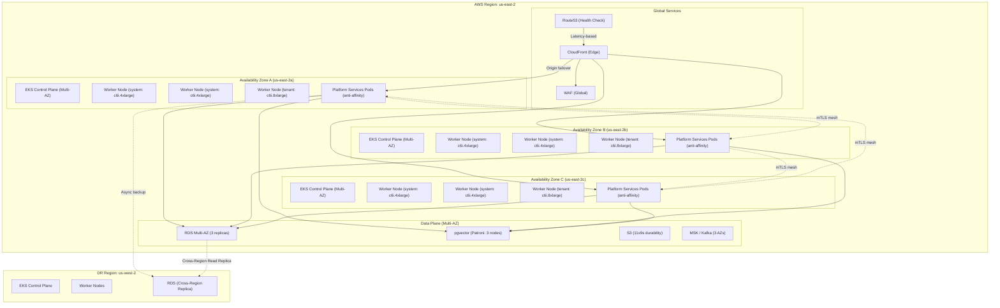
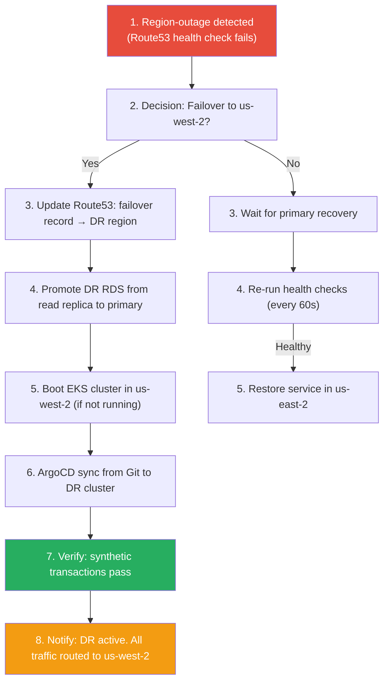

# Deployment Architecture: AI-Driven Secure GitOps Kubernetes Platform

## Document Control

| Attribute | Value |
|---|---|
| **Document ID** | ARC-DEPL-005 |
| **Version** | 1.0 |
| **Classification** | Internal — Operations |
| **Author** | Platform Architecture Team |
| **Last Updated** | 2026-05-17 |

---

## 1. Multi-AZ High Availability Topology

The platform runs across three Availability Zones within a single AWS region. Each AZ contains a copy of every critical component, and all traffic is load-balanced across AZs.



### Availability SLAs

| Component | Configuration | Uptime SLA | AZ Failure Tolerance |
|---|---|---|---|
| **EKS Control Plane** | AWS-managed multi-AZ | 99.95% | 2 AZ loss (control plane remains available) |
| **Worker Nodes** | Spread across 3 AZs via topologySpreadConstraints | 99.99% (target) | 1 AZ loss (remaining 2 AZs handle load) |
| **RDS PostgreSQL** | Multi-AZ with 2 standby replicas; auto-failover < 30s | 99.95% | 1 AZ loss (auto-failover to standby) |
| **pgvector** | Patroni cluster with 3 nodes (sync replication) | 99.99% | 1 node loss (auto-failover, no data loss) |
| **Istio Control Plane** | 3 replicas with anti-affinity + PodDisruptionBudget (min 2) | 99.99% | 1 AZ loss (quorum maintained) |
| **ArgoCD** | 3 replicas + HA Redis cache | 99.99% | 1 AZ loss (quorum maintained) |
| **CloudFront/WAF** | Global edge network (anycast) | 99.99% | N/A (global) |

---

## 2. Disaster Recovery Architecture

### 2.1 RPO and RTO Targets

| Tier | Scenario | Recovery Point Objective (RPO) | Recovery Time Objective (RTO) | Strategy |
|---|---|---|---|---|
| **Tier 0** | Region-wide outage | < 5 minutes | < 30 minutes | Active-passive DR (warm standby) |
| **Tier 1** | Cluster failure (EKS) | < 15 minutes | < 2 hours | Rebuild cluster + restore from backup |
| **Tier 2** | Data corruption | Point-in-time recovery (PITR) - 5 min granularity | < 30 minutes | RDS PITR + etcd restore |
| **Tier 3** | Accidental namespace deletion | < 24 hours | < 4 hours | Velero backup (daily + on-demand) |

### 2.2 DR Runbook Summary



### 2.3 Backup Strategy

| Resource | Tool | Frequency | Retention | Storage |
|---|---|---|---|---|
| **etcd snapshots** | Velero + etcd-backup-operator | Every 4 hours | 90 days | S3 (separate bucket, versioned) |
| **K8s resources** | Velero | Daily + on-demand | 365 days | S3 (cross-region copy enabled) |
| **Persistent volumes** | Velero + CSI snapshot | Daily | 30 days | EBS snapshots (cross-region copy) |
| **RDS databases** | Automated backup | Continuous (5-min PITR) | 35 days | AWS-managed S3 |
| **pgvector** | pg_dump + WAL archiving | Continuous (WAL) + daily dump | 30 days | S3 (encrypted with KMS) |
| **Prometheus data** | Thanos sidecar | Every 2 hours to S3 | 180 days | S3 (object lock, immutable) |
| **Container images** | ECR replication | Cross-region | Indefinite (immutable tags) | ECR (replicated to us-west-2) |

---

## 3. Scalability Model

### 3.1 Horizontal Pod Autoscaling (HPA)

```yaml
apiVersion: autoscaling/v2
kind: HorizontalPodAutoscaler
metadata:
  name: aio-api-hpa
  namespace: platform-aio
spec:
  scaleTargetRef:
    apiVersion: apps/v1
    kind: Deployment
    name: aio-api
  minReplicas: 3
  maxReplicas: 20
  behavior:
    scaleUp:
      stabilizationWindowSeconds: 60
      policies:
      - type: Percent
        value: 100
        periodSeconds: 15
    scaleDown:
      stabilizationWindowSeconds: 300
      policies:
      - type: Pods
        value: 2
        periodSeconds: 60
  metrics:
  - type: Resource
    resource:
      name: cpu
      target:
        type: Utilization
        averageUtilization: 70
  - type: Resource
    resource:
      name: memory
      target:
        type: Utilization
        averageUtilization: 80
```

### 3.2 Cluster Autoscaler / Karpenter

The platform uses **Karpenter** for node-level scaling due to its superior bin-packing and provisioning speed:

| Dimension | Karpenter Configuration |
|---|---|
| **Node provisioning** | < 60 seconds from pod creation to node ready |
| **Instance diversity** | c6i, m6i, r6i families; spot + on-demand mix |
| **Spot fallback** | 70% spot, 30% on-demand; Karpenter handles interruption |
| **Consolidation** | Enabled (default) — consolidates pods onto fewer nodes every 5 min |
| **Topology spread** | `topology.kubernetes.io/zone` required |

### 3.3 Scaling Dimensions

| Dimension | Mechanism | Trigger | Upper Bound |
|---|---|---|---|
| **Pod-level** | HPA (CPU/Memory/custom metrics) | > 70% CPU or > 80% memory for 1 min | 20 pods per Deployment |
| **Node-level** | Karpenter | Unschedulable pods; low node capacity | 100 nodes per cluster |
| **Cluster-level** | Manual / Cluster API | Namespace exhaustion; AZ capacity constraints | 3,000 pods per cluster (EKS limit) |
| **Control plane** | AWS-managed (EKS) | Auto-scaled by AWS | 300 etcd requests/sec |
| **Database** | RDS read replicas + Proxy | > 1,000 connections or > 80% CPU | 10 read replicas per writer |
| **AIOps ingestion** | HPA + queue-based backpressure | Queue depth > 1,000 events | 20 replicas per AZ |

### 3.4 Burst Handling

During incident surge (e.g., widespread Falco events), the AIOps API backs off via:

1. **Event sampling**: If event rate exceeds 5K/sec, switch to 1:10 sampling for LOW/MEDIUM events
2. **Priority queue**: CRITICAL events always processed; HIGH processed within 30s; LOW within 5 min
3. **Ephemeral workers**: KEDA ScaledObject creates event-driven workers from queue depth

---

## 4. Network Architecture

```mermaid
graph TB
    subgraph "AWS Organization"
        subgraph "Hub Account (Networking)"
            TGW["Transit Gateway"]
            NGW["NAT Gateway (3 AZs)"]
            NFW["AWS Network Firewall"]
            VPCE["VPC Endpoints (PrivateLink)"]
        end

        subgraph "Platform Account (EKS)"
            subgraph "VPC: 10.0.0.0/16"
                subgraph "Public Subnets (10.0.1-3.0/24)"
                    IGW["Internet Gateway"]
                    ALB["NLB/ALB (Internal)"]
                end
                subgraph "Private Subnets (10.0.10-39.0/24)"
                    KARP["Karpenter Nodes"]
                    SYSTEM["System Pods<br/>(GitOps, Kyverno, Istio)"]
                    TENANT["Tenant Pods<br/>(Application Workloads)"]
                end
                subgraph "Data Subnets (10.0.40-49.0/24)"
                    RDS_SN["RDS"]
                    PGV_SN["pgvector"]
                    EFS_SN["EFS"]
                end
                subgraph "Pod Subnets (10.1.0.0/16)")
                    PODS["K8s Pods (Calico IPAM)"]
                end
            end
        end

        subgraph "Security Account"
            CW["CloudWatch Logs"]
            S3_["S3 Audit Bucket (Object Lock)"]
            KMS_["KMS (FIPS HSM)"]
        end
    end

    IGW -->|80/443| ALB
    ALB -->|PrivateLink| VPCE
    VPCE --> TGW
    TGW -->|VPC Attachment| SYSTEM
    TGW -->|VPC Attachment| TENANT
    SYSTEM -->|Egress| NGW
    NGW --> NFW
    NFW -->|Filtered| IGW
    TENANT -->|Egress| NGW
    SYSTEM --> VPCE
    TENANT --> VPCE
    VPCE -->|S3, ECR, SecretsManager, KMS| S3_
    VPCE --> KMS_
    VPCE --> CW
```

### Network Addressing and CIDR Allocation

| Network Segment | CIDR | Purpose | Route Table |
|---|---|---|---|
| VPC | 10.0.0.0/16 | EKS cluster VPC | Main |
| Public Subnets | 10.0.1.0/24, 10.0.2.0/24, 10.0.3.0/24 | Load balancers, NAT Gateway | Public (IGW via 0.0.0.0/0) |
| Private (System) | 10.0.10-19.0/24 (3 AZs) | System/control plane components | Private (NAT via 0.0.0.0/0) |
| Private (Tenant) | 10.0.20-29.0/24 (3 AZs) | Application workloads | Private (NAT via 0.0.0.0/0) |
| Data Subnets | 10.0.40-49.0/24 (3 AZs) | RDS, pgvector, ElastiCache | Private (no egress; VPC endpoints) |
| Pod CIDR | 10.1.0.0/16 | Kubernetes pods | Private (Calico) |
| Service CIDR | 172.20.0.0/16 | K8s ClusterIP services | Internal |
| Transit Gateway | 10.0.100.0/24 | TGW attachment | Propagates to spoke VPCs |

### Egress Flow

All outbound internet traffic follows this path:

```
Pod → Calico NetworkPolicy (allow/deny) → Calico Egress Gateway → NAT Gateway → AWS Network Firewall (inspect) → Internet
```

DNS resolution is handled via Route53 Resolver endpoints in the VPC, with conditional forwarding for private hosted zones.

---

## 5. Cost Optimization Strategy

| Strategy | Implementation | Estimated Savings |
|---|---|---|
| **Spot instances** | 70% spot, 30% on-demand via Karpenter; node pools for critical components | 60–70% vs. on-demand |
| **Compute right-sizing** | Karpenter consolidation + VPA recommendations for stable workloads | 15–25% |
| **Storage tiering** | EBS gp3 (default) → cold tier for unused volumes; S3 lifecycle policies | 30–50% on storage |
| **Resource limits** | Vertical Pod Autoscaler + LimitRange to prevent over-provisioning | 20–30% |
| **Environment consolidation** | Dev/staging clusters scaled down to 3 nodes during non-business hours | 50% off-peak |
| **Reserved Instances** | 1-year Compute Savings Plan for 60% of baseline capacity | 30% vs. on-demand |
| **Data transfer** | All inter-service via PrivateLink/VPC; no NAT egress for cross-AZ traffic | 80% reduction in data transfer cost |

### Monthly Cost Estimate (Baseline: 3-AZ, 100 tenant pods)

| Category | On-Demand Cost | Optimized Cost |
|---|---|---|
| Compute (EKS nodes) | $18,500 | $6,200 |
| Storage (EBS + S3) | $3,200 | $1,800 |
| Data transfer | $2,100 | $420 |
| Managed services (RDS, MSK) | $4,800 | $4,800 |
| Observability (Prometheus monitoring infra) | $2,400 | $1,200 |
| **Total** | **$31,000** | **$14,420** |

---

## 6. Resource Allocation Strategy

### 6.1 Quality of Service Tiers

| Tier | Namespace Pattern | Guaranteed CPU | Burstable | Priority Class | OOM Score | Examples |
|---|---|---|---|---|---|---|
| **Platinum** | `platform-*` | 100% (Guaranteed) | Yes | `platform-critical` | -998 | ArgoCD, Kyverno, Istiod, AIOps |
| **Gold** | `tenant-prod-*` | 50% (Guaranteed) | Up to 2x | `production` | -500 | Production apps |
| **Silver** | `tenant-staging-*` | 0 (Burstable) | Up to 4x | `staging` | 0 | Staging apps |
| **Bronze** | `tenant-dev-*` | 0 (Burstable) | Up to 8x | `development` | 500 | Dev apps |
| **Batch** | `batch-*` | 0 (BestEffort) | No limits | `batch` | 1000 | CI runner, data processing |

### 6.2 Node Pool Configuration

| Pool | Instance Family | Min/Max Nodes | Taints | Labels | Use Case |
|---|---|---|---|---|---|
| `system` | c6i.4xlarge | 3 / 12 | CriticalAddonsOnly:NoSchedule | `node-type=system` | ArgoCD, Istio, Kyverno, AIOps |
| `platform-obs` | m6i.4xlarge | 3 / 8 | `obs-dedicated=true:NoSchedule` | `node-type=observability` | Prometheus, Grafana, OTel |
| `tenant-prod` | c6i.8xlarge + spot mix | 5 / 50 | None | `node-type=tenant`, `tier=prod` | Production workloads |
| `tenant-nonprod` | m6i.4xlarge spot | 3 / 30 | None | `node-type=tenant`, `tier=nonprod` | Dev/staging/batch |
| `gpu` | g5.2xlarge (on-demand) | 0 / 5 | `nvidia.com/gpu=true:NoSchedule` | `node-type=gpu` | AI model inference, training |

### 6.3 Pod Priority and Preemption

Priority classes ensure critical platform components are never preempted by tenant workloads during resource contention:

```yaml
apiVersion: scheduling.k8s.io/v1
kind: PriorityClass
metadata:
  name: platform-critical
value: 1000000
globalDefault: false
description: "Platform-critical components - never preempted"
---
apiVersion: scheduling.k8s.io/v1
kind: PriorityClass
metadata:
  name: production
value: 500000
globalDefault: false
---
apiVersion: scheduling.k8s.io/v1
kind: PriorityClass
metadata:
  name: batch
value: 5000
globalDefault: false
```

In practice, during a node failure:
1. `batch` pods are preempted first
2. `development` pods are preempted second
3. `staging` pods are preempted third
4. `production` pods are never preempted
5. `platform-critical` pods are never preempted
