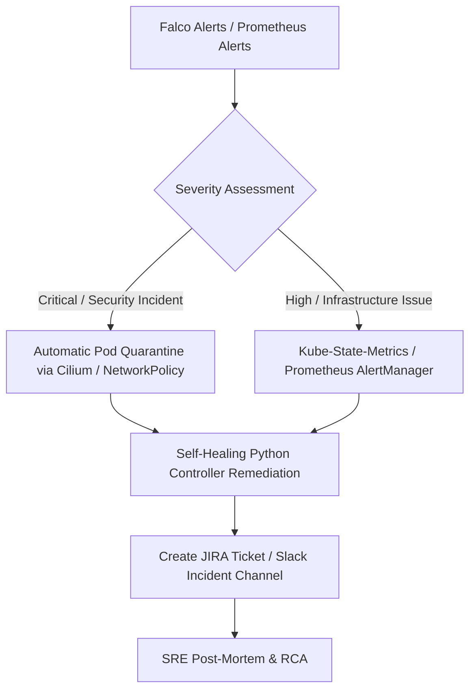

# Enterprise SRE Incident Response & Self-Healing Playbook
## AI-Driven Secure GitOps Platform

This playbook contains operational instructions for platform engineers, SREs, and DevOps engineers managing the platform. It outlines incident response flows, self-healing architectures, and step-by-step procedures for runtime failure simulations.

---

## 1. Incident Response Lifecycle



### Response SLAs
* **Severity 1 (Critical Security Breach):** Immediate (automated containment in < 10 seconds, human engagement in < 5 mins).
* **Severity 2 (High Outage/Service Degradation):** Automated failover in < 60 seconds, human engagement in < 15 mins.
* **Severity 3 (Medium/Low Non-Outage):** Dynamic scheduling, remediation in < 4 hours.

---

## 2. Dynamic Remediation Procedures

### A. Crypto Miner Detection & Containment
When Falco detects high CPU or connections to Stratum mining pools:
1. **Automated Step:** The `remediation-controller` scales down the compromised pod to 0.
2. **SRE Manual Verification:**
   ```bash
   # Check security alerts
   kubectl logs -n security -l app=falco --tail=100 | grep -i "Crypto miner"
   
   # Inspect the quarantined container image
   kubectl describe pod <pod-name> -n <namespace>
   ```

### B. CoreDNS DNS Outage Recovery
In case CoreDNS is scaled down or crashed:
1. **Diagnostic Command:**
   ```bash
   kubectl get pods -n kube-system -l k8s-app=kube-dns
   ```
2. **Manual Failover:**
   ```bash
   # Restore replicas
   kubectl scale deployment/coredns -n kube-system --replicas=2
   ```

---

## 3. Chaos Engineering Simulations

To run automated chaos experiments, execute the scripts located in the failure simulations directory:

| Scenario | Script Path | Purpose |
| :--- | :--- | :--- |
| **Reverse Shell** | `platform/scripts/failure-simulations/simulate-reverse-shell.sh` | Trigger process execution security alerts. |
| **Crypto Miner** | `platform/scripts/failure-simulations/simulate-crypto-miner.sh` | Trigger miner stratum pool network alerts. |
| **DNS Outage** | `platform/scripts/failure-simulations/simulate-dns-outage.sh` | Trigger CoreDNS scale-down and network partition tests. |
| **Crash Loop** | `platform/scripts/failure-simulations/create-crash-loop.sh` | Induce pod restarts to test self-healing loop. |

---

## 4. Disaster Recovery & Rollback

### ArgoCD GitOps Git Rollback
If a deployment is unstable, **never** run `kubectl edit` directly. Instead, rollback the Git release:
```bash
# Revert the latest commit in your Git repository
git revert HEAD
git push origin main
```
ArgoCD will automatically reconcile and roll back the cluster resources to the previous state.
